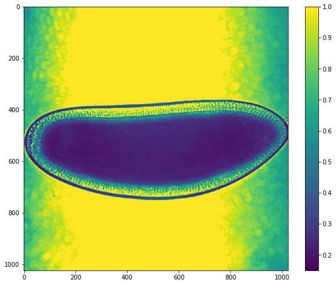
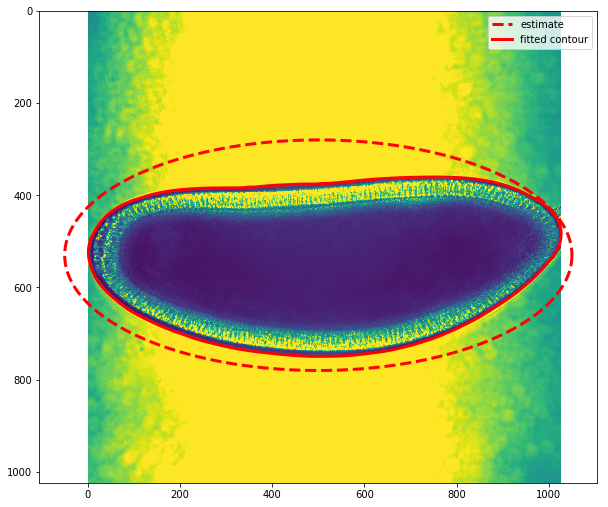
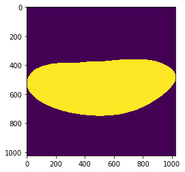
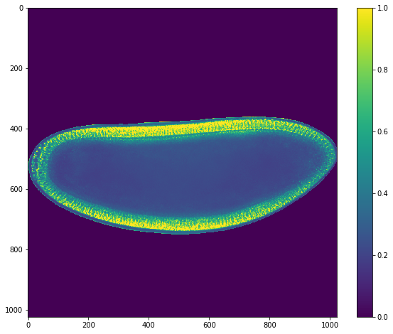
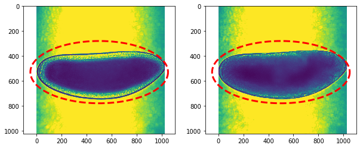
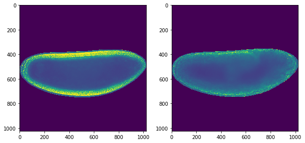

Segment the embryo from the background in order to clearly isolate
changes in signal associated with germ band extension

.. code:: ipython3

    import numpy as np
    import matplotlib.pyplot as plt
    
    from imp import reload
    import sys
    sys.path.insert(0, '..')
    import utilities as ut
    
    from skimage import img_as_float
    from skimage.filters import gaussian
    from skimage.segmentation import active_contour
    from skimage.measure import grid_points_in_poly

Data Import
------------

Read in hdf5 hyperstack as a 3d numpy array. Convert to float for ease
of processing.

.. code:: ipython3

    hst = img_as_float(ut.read_hyperstack('../data/wt_gbe_20180110.h5'))

Select a single image from the first timepoint to use as a test case for
segmentation development

.. code:: ipython3

    img = hst[0]

.. code:: ipython3

    ut.imshow(img)

Background Segmentation
------------------------

In order to analyze any signal variation that is associated with germ
band extension, we need to isolate the signal of the embryo from any
background. This task is complicated by the nature of brightfield images
where the intensity of the background ~1 is similar to the intensity of
cells within the image. As a result we cannot use a simple threshold
which would remove signal from within the embryo as well as from the
background.

However, the embryo does have a clear dark line that separates the
embryo itself from the background. We will take advantage of this clear
line to separate the embryo from the background using contour based
methods.

To start, we will approximate an ellipse that is slightly bigger than
the size of the embryo, which will provide a starting point for contour
fitting.

.. code:: ipython3

    # Values to calculate the ellipse over using parametrized trigonometric fxns
    s = np.linspace(0, 2*np.pi, 400)
    
    # Define the approximate center of the embryo/ellipse
    center_x = 500
    center_y = 530
    
    # Define the radius of the ellipse in x and y
    radius_x = 550
    radius_y = 250
    
    # Calculate the position of the ellipse as a function of s
    x = center_x + radius_x*np.cos(s)
    y = center_y + radius_y*np.sin(s)
    init = np.array([x, y]).T

Next we will use ``skimage``'s ``active_contour`` method to fit our
approximated ellipse to the contour of the embryo. The kwarg parameters
for this function were copied based on the `active countour
tutorial <http://scikit-image.org/docs/dev/auto_examples/edges/plot_active_contours.html>`__.

.. code:: ipython3

    snake = active_contour(gaussian(img, 3),
                           init, alpha=0.015, beta=10, gamma=0.001)

.. code:: ipython3

    fig,ax = plt.subplots(figsize=(10,10))
    ax.imshow(img)
    ax.plot(init[:, 0], init[:, 1], '--r', lw=3,label='estimate')
    ax.plot(snake[:, 0], snake[:, 1], '-r', lw=3,label='fitted contour')
    ax.legend()

.. parsed-literal::

    <matplotlib.legend.Legend at 0x1c19e6f048>

The plot above shows our image overlaid with the approximated ellipse
(dashed line) and the fitted counter (red continuous line). This contour
follows the boundary between the embryo and the background.

Create background mask
------------------------

Now that we have a estimated function ``snake`` that defines the
boundary of the embryo and the background, we need to define a mask in
the shape of the image that defines which points belong in the image.
Skimage's ``grid_points_in_poly`` function takes a set of points
defining a shape (``snake``) and identifies which points over a given
raster area fall within the input shape.

.. code:: ipython3

    mask = grid_points_in_poly(img.shape, snake).T
    plt.imshow(mask)

.. parsed-literal::

    <matplotlib.image.AxesImage at 0x1c1aa11c88>

.. code:: ipython3

    im_masked = img.copy()
    im_masked[~mask] = 0
    ut.imshow(im_masked)

Write a function to fit a contour to a new embryo
--------------------------------------------------

.. code:: ipython3

    def calc_ellipse(center_x,center_y,radius_x,radius_y):
        '''
        Calculate a parametrized ellipse based on input values
        '''
        
        # Values to calculate the ellipse over using parametrized trigonometric fxns
        s = np.linspace(0, 2*np.pi, 400)
        
        # Calculate the position of the ellipse as a function of s
        x = center_x + radius_x*np.cos(s)
        y = center_y + radius_y*np.sin(s)
        init = np.array([x, y]).T
        
        return(init)

.. code:: ipython3

    def contour_embryo(img,init):
        '''
        Fit a contour to the embryo to separate the background
        Returns a masked image where all background points = 0
        '''
        
        # Fit contour based on starting ellipse
        snake = active_contour(gaussian(img, 3),
                           init, alpha=0.015, beta=10, gamma=0.001)
        
        # Create boolean mask based on contour
        mask = grid_points_in_poly(img.shape, snake).T
        
        # Apply mask to image and set background to 0
        img[~mask] = 0
        
        return(img)

Apply mask to hyperstack
---------------------------

Check ellipse approximation on first and last timepoints

.. code:: ipython3

    center_x,center_y = 500,530
    radius_x,radius_y = 550,250
    ellipse = calc_ellipse(center_x,center_y,radius_x,radius_y)

.. code:: ipython3

    fig,ax = plt.subplots(1,2,figsize=(10,8))
    ax[0].imshow(hst[0])
    ax[0].plot(init[:,0],init[:,1],'--r',lw=3)
    ax[1].imshow(hst[-1])
    ax[1].plot(init[:,0],init[:,1],'--r',lw=3)

.. parsed-literal::

    [<matplotlib.lines.Line2D at 0x1c1a65a978>]

.. code:: ipython3

    # Loop through each timepoint in hyperstack
    for t in range(hst.shape[0]):
        hst[t] = contour_embryo(hst[t],ellipse)

.. code:: ipython3

    fig,ax = plt.subplots(1,2,figsize=(10,8))
    ax[0].imshow(hst[0])
    ax[1].imshow(hst[-1])

.. parsed-literal::

    <matplotlib.image.AxesImage at 0x1c1a3349e8>

