Calculate the time when mesoderm invagination occurs in order to align
samples in time and to start point tracking at the start of germband
invagination

.. code-block:: python

    import numpy as np
    import pandas as pd
    
    import matplotlib
    matplotlib.use('agg')
    import matplotlib.pyplot as plt
    
    import tifffile
    import av
    
    import tqdm
    
    import gbeflow

.. code-block:: python

    fs = ['20180108_htl_glc_sc11_mmzm_rotate_brt',
     '20180108_htl_glc_sc2_mmzm_wp_rotate_brt',
     '20180108_htl_glc_sc9_mmzp_rotate_brt',
     '20180110_htl_glc-CreateImageSubset-01_sc10_wt_rotate_brt',
     '20180110_htl_glc-CreateImageSubset-02_sc11_htl_rotate_brt',
     '20180110_htl_glc_sc14_mmzp_rotate_brt',
     '20180110_htl_glc_sc15_mmzm_rotate_brt',
     '20180110_htl_glc_sc6_mmzm_rotate_brt',
     '20180112_htlglc_tl_sc11_mmzp_rotate_brt',
     '20180112_htlglc_tl_sc4_resille_rotate_brt']

Select a single sample as a test case

.. code-block:: python

    f = '20180110_htl_glc_sc14_mmzp_rotate_brt'

Load vector data and movie mesoderm_figs/output

.. code-block:: python

    # vimg = gbeflow.load_avi_as_array(f+'.avi')
    vf = gbeflow.VectorField(f)

.. code-block:: python

    expected = 35

.. code-block:: python

    fig,ax = plt.subplots(figsize=(10,8))
    ax.imshow(vimg[expected])

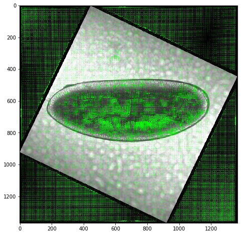

Test metrics for detecting mesoderm invagination
---------------------------------------------------

Sum of y component of vectors over time
^^^^^^^^^^^^^^^^^^^^^^^^^^^^^^^^^^^^^^^^^^

.. code-block:: python

    vf.vy.shape

.. parsed-literal::

    (166, 270, 270)

.. code-block:: python

    ysum = np.sum(vf.vy,axis=(1,2))

.. code-block:: python

    fig,ax = plt.subplots()
    ax.plot(ysum)
    ax.axvline(expected,c='r')

.. parsed-literal::

    <matplotlib.lines.Line2D at 0x109358d30>

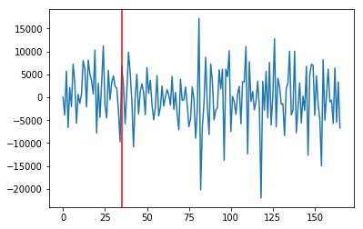

Try looking at the sum of only positive vy components
^^^^^^^^^^^^^^^^^^^^^^^^^^^^^^^^^^^^^^^^^^^^^^^^^^^^^^^^^^^^^^^^^^^^^^^^^^^^^^^^^^^^

.. code-block:: python

    vfpos = np.copy(vf.vy)
    vfpos[vfpos<0] = 0

.. code-block:: python

    ysum = np.sum(vfpos,axis=(1,2))
    fig,ax = plt.subplots()
    ax.plot(ysum)
    ax.axvline(expected,c='r')

.. parsed-literal::

    <matplotlib.lines.Line2D at 0x1d21e1fc50>

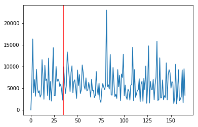

What about within an roi
^^^^^^^^^^^^^^^^^^^^^^^^^^^^^^^^^^^^^^^^^^

.. code-block:: python

    roi = np.s_[:,400:900,:]

.. code-block:: python

    fig,ax = plt.subplots()
    ax.imshow(vimg[roi][35])

.. parsed-literal::

    <matplotlib.image.AxesImage at 0x11579f0b8>

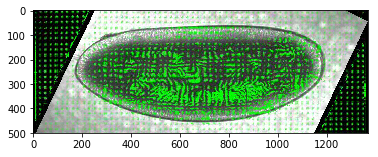

.. code-block:: python

    np.interp(a, (a.min(), a.max()), (-1, +1))

.. code-block:: python

    roirange = np.interp([400,900], (0,1368), (0,270))
    roirange

.. parsed-literal::

    array([ 78.94736842, 177.63157895])

.. code-block:: python

    vroi = np.s_[:,int(roirange[0]):int(roirange[1]),:]

.. code-block:: python

    vfpos[vroi].shape

.. parsed-literal::

    (166, 99, 270)

.. code-block:: python

    ysum = np.sum(vfpos[vroi],axis=(1,2))
    fig,ax = plt.subplots()
    ax.plot(ysum)
    ax.axvline(expected,c='r')

.. parsed-literal::

    <matplotlib.lines.Line2D at 0x1d239af9e8>

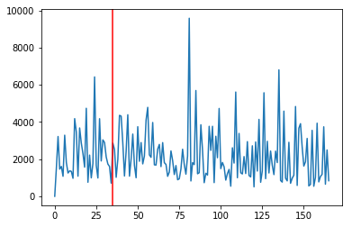

Sum of the squared positive vy
^^^^^^^^^^^^^^^^^^^^^^^^^^^^^^^^^^^^^^^^^^

.. code-block:: python

    ysum = np.sum(np.power(vfpos[vroi],2),axis=(1,2))

.. code-block:: python

    fig,ax = plt.subplots()
    ax.plot(ysum)
    ax.axvline(expected,c='r')
    ax.axvline(55,c='m')

.. parsed-literal::

    <matplotlib.lines.Line2D at 0x1d24b19eb8>

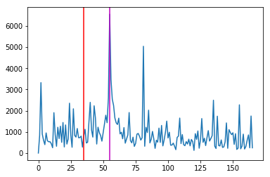

.. code-block:: python

    fig,ax = plt.subplots(figsize=(10,8))
    ax.imshow(vimg[roi][55])

.. parsed-literal::

    <matplotlib.image.AxesImage at 0x1d24c678d0>

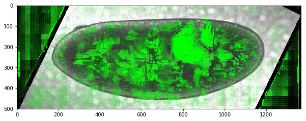

While we are not detecting mesoderm invagination here, this feature does
mark germband extension which could be useful in itself.

Let's try this on other samples to see if the feature is consistent
---------------------------------------------------------------------

.. code-block:: python

    Dvimg = {}
    for f in fs:
        try:
            Dvimg[f] = gbeflow.load_avi_as_array(f+'.avi')
        except:
            print('Video import failed',f)

.. code-block:: python

    Dvf = {}
    for f in Dvimg.keys():
        try:
            Dvf[f] = gbeflow.VectorField(f)
        except:
            print('Import failed',f)

.. code-block:: python

    Dsum = {}
    for f in Dvimg.keys():
        vfpos = np.copy(Dvf[f].vy)
        vfpos[vfpos<0] = 0
        Dsum[f] = np.sum(np.power(vfpos[vroi],2),axis=(1,2))

.. code-block:: python

    for f in Dsum.keys():
        fig,ax = plt.subplots(1,2,figsize=(10,8))
        ax[0].plot(Dsum[f])
        ax[0].axvline(maxsum[f],c='r')
        ax[0].set_title(f)
        ax[1].imshow(Dvimg[f][roi][maxsum[f]])

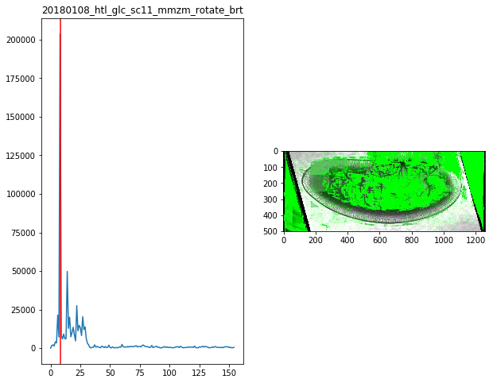

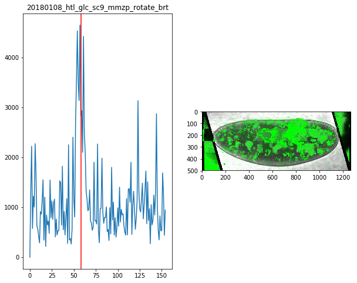

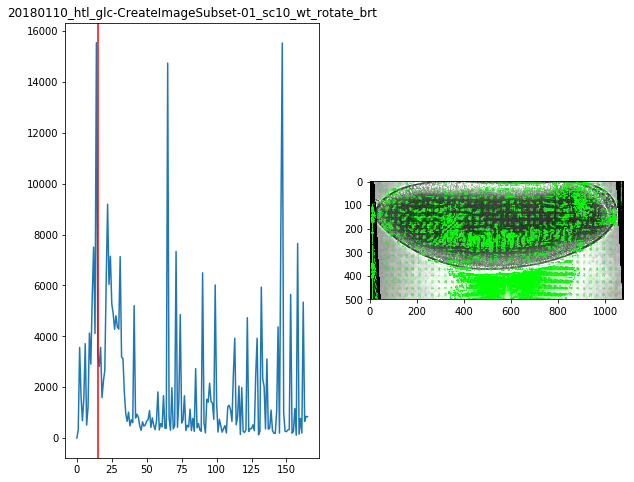

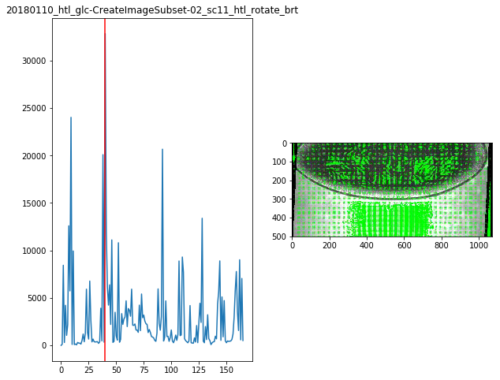

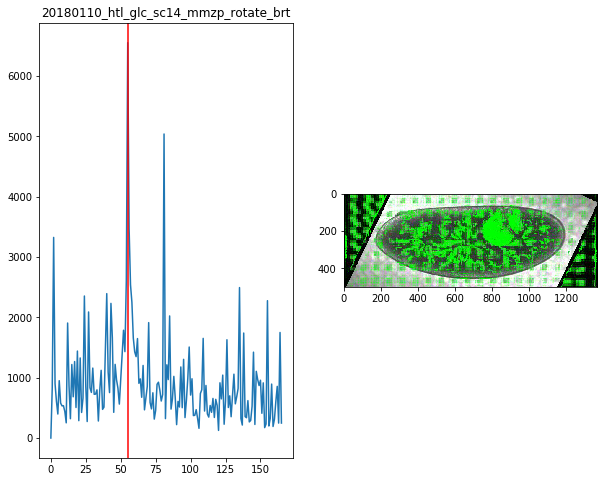

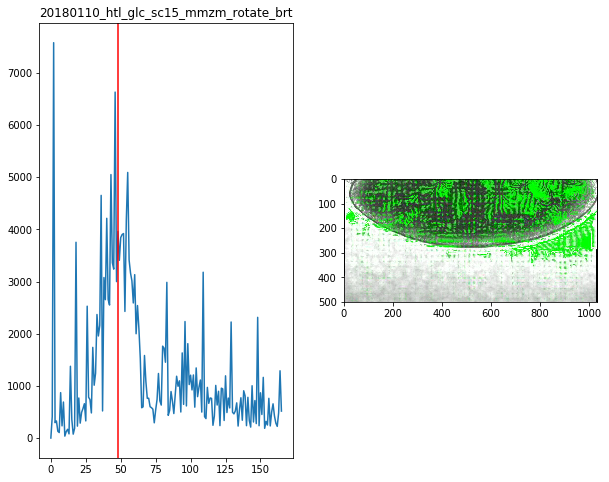

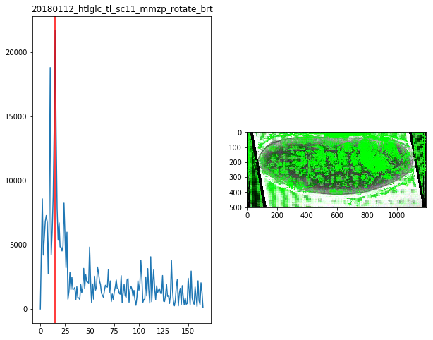

.. code-block:: python

    maxsum = {
        '20180108_htl_glc_sc11_mmzm_rotate_brt':8,
        '20180108_htl_glc_sc9_mmzp_rotate_brt':58,
        '20180110_htl_glc-CreateImageSubset-01_sc10_wt_rotate_brt':15,
        '20180110_htl_glc-CreateImageSubset-02_sc11_htl_rotate_brt':40,
        '20180110_htl_glc_sc14_mmzp_rotate_brt':55,
        '20180110_htl_glc_sc15_mmzm_rotate_brt':48,
        '20180112_htlglc_tl_sc11_mmzp_rotate_brt':15
    }

For the time being it looks like manually selecting the timepoint of
mesoderm invagination will be more expedient.

Check manual assignments
--------------------------

.. code-block:: python

    tpoints = pd.read_csv('mesoderm_invagination.csv')
    tpoints

.. raw:: html

    

    
    <table border="1" class="dataframe">
      <thead>
        <tr style="text-align: right;">
          <th></th>
          <th>File</th>
          <th>Timepoint</th>
        </tr>
      </thead>
      <tbody>
        <tr>
          <th>0</th>
          <td>20180110_htl_glc_sc14_mmzp_rotate_brt.avi</td>
          <td>36</td>
        </tr>
        <tr>
          <th>1</th>
          <td>20180108_htl_glc_sc9_mmzp_rotate_brt.avi</td>
          <td>36</td>
        </tr>
        <tr>
          <th>2</th>
          <td>20180108_htl_glc_sc11_mmzm_rotate_brt.avi</td>
          <td>62</td>
        </tr>
        <tr>
          <th>3</th>
          <td>20180110_htl_glc_sc15_mmzm_rotate_brt.avi</td>
          <td>41</td>
        </tr>
        <tr>
          <th>4</th>
          <td>20180110_htl_glc-CreateImageSubset-01_sc10_wt_...</td>
          <td>16</td>
        </tr>
        <tr>
          <th>5</th>
          <td>20180110_htl_glc-CreateImageSubset-02_sc11_htl...</td>
          <td>57</td>
        </tr>
        <tr>
          <th>6</th>
          <td>20180112_htlglc_tl_sc11_mmzp_rotate_brt.avi</td>
          <td>4</td>
        </tr>
      </tbody>
    </table>
    

.. code-block:: python

    tpoints[tpoints['File']==f+'.avi'].values[-1,-1]

.. parsed-literal::

    62

.. code-block:: python

    for f in Dvimg.keys():
        fig,ax = plt.subplots(figsize=(10,8))
        t = tpoints[tpoints['File']==f+'.avi'].values[-1,-1]
        ax.imshow(Dvimg[f][t])
        ax.set_title(f)

Test track interpolation starting at mesoderm invagination
-------------------------------------------------------------

.. code-block:: python

    tracks = pd.read_csv('20181128-tracking.csv')
    tracks.head()

.. code-block:: python

    starts = tracks[tracks.t==0][['f','x','y']]

.. code-block:: python

    trange = range(maxsum[f],np.max(vf.tval))
    (trange)

.. code-block:: python

    xpos = [x0]*(maxsum[f]+1)
    ypos = [y0]*(maxsum[f]+1)

.. code-block:: python

    for t in trange:
        dx = vf.Ldx[t].ev(xpos[t],ypos[t])
        dy = vf.Ldy[t].ev(xpos[t],ypos[t])
        
        xpos.append(xpos[t] + dx*60)
        ypos.append(ypos[t] + dy*60)

.. code-block:: python

    track = np.array([xpos,ypos])
    trackdf = pd.DataFrame({'x':track[0,:],'y':track[1,:],'t':vf.tval,
                            'track':[i]*track.shape[-1],
                            'name':['test']*track.shape[-1]})

Track visualization
^^^^^^^^^^^^^^^^^^^^^^^^

.. code-block:: python

    tracks = pd.concat(Ltrack,keys=list(Dvf.keys())
                      ).reset_index(
                      ).drop(columns=['level_1']
                      ).rename(columns={'level_0':'file'})
 
.. code-block:: python

    for f in tracks['file'].unique():
        fig,ax = plt.subplots()
        sb = tracks[tracks['file']==f]
        ax.scatter(sb.x,sb.y)#,c=sb.t,cmap='plasma')

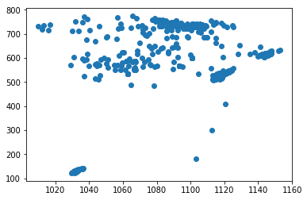

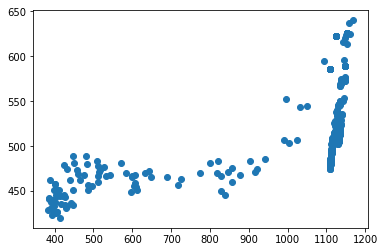

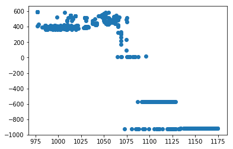

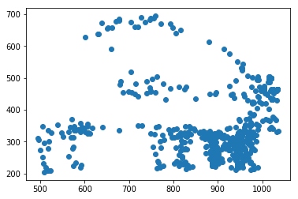

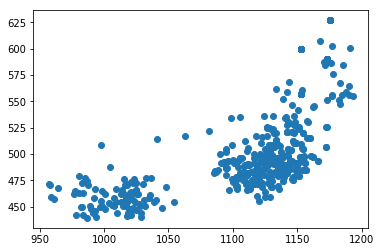

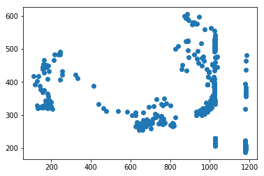

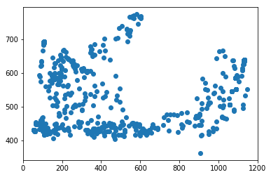

.. code-block:: python

    for f in tracks['file'].unique():
        gbeflow.make_track_movie(Dvimg[f],tracks[tracks.file==f],c='r',
                                name='20181202_'+f+'_tracks')

Attempting to start interpolating the tracks at the time of mesoderm
invagination does not appear to improve the results of the tracking
since there is still a large fraction that wanders out of the frame
entirely.
